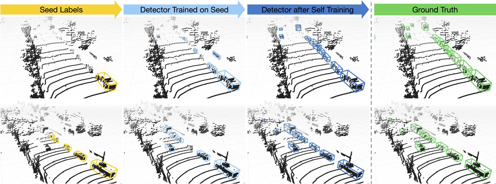

# Learning to Detect Mobile Objects from LiDAR Scans Without Labels

This is the official code release for

[[CVPR 2022] **Learning to Detect Mobile Objects from LiDAR Scans Without Labels**](https://arxiv.org/pdf/2203.15882.pdf).

by [Yurong You](https://yurongyou.com/)\*, [Katie Z Luo](https://www.cs.cornell.edu/~katieluo/)\*, [Cheng Perng Phoo](https://www.cs.cornell.edu/~cpphoo/), [Wei-Lun Chao](https://sites.google.com/view/wei-lun-harry-chao), [Wen Sun](https://wensun.github.io/), [Bharath Hariharan](http://home.bharathh.info/), [Mark Campbell](https://research.cornell.edu/researchers/mark-campbell), and [Kilian Q. Weinberger](https://www.cs.cornell.edu/~kilian/)

[Paper](https://arxiv.org/pdf/2203.15882.pdf)



### Abstract
Current 3D object detectors for autonomous driving are almost entirely trained on human-annotated data. Although of high quality, the generation of such data is laborious and costly, restricting them to a few specific locations and object types. This paper proposes an alternative approach entirely based on unlabeled data, which can be collected cheaply and in abundance almost everywhere on earth. Our approach leverages several simple common sense heuristics to create an initial set of approximate seed labels. For example, relevant traffic participants are generally not persistent across multiple traversals of the same route, do not fly, and are never under ground. We demonstrate that these seed labels are highly effective to bootstrap a surprisingly accurate detector through repeated self-training without a single human annotated label.

### Citation
```
@inproceedings{you2022learning,
  title = {Learning to Detect Mobile Objects from LiDAR Scans Without Labels},
  author = {You, Yurong and Luo, Katie Z and Phoo, Cheng Perng and Chao, Wei-Lun and Sun, Wen and Hariharan, Bharath and Campbell, Mark and Weinberger, Kilian Q.},
  booktitle = {Proceedings of the IEEE Conference on Computer Vision and Pattern Recognition (CVPR)},
  year = {2022},
  month = jun
}
```

## Environment
```bash
conda create --name modest python=3.8
conda activate modest
conda install pytorch=1.9.0 torchvision torchaudio cudatoolkit=11.1 -c pytorch -c nvidia
pip install opencv-python matplotlib wandb scipy tqdm easydict scikit-learn pyquaternion pillow==8.3.2
# for managing experiments
pip install hydra-core --upgrade
pip install hydra_colorlog --upgrade
pip install rich

cd generate_cluster_mask/utils/iou3d_nms
python setup.py install
```
for OpenPCDet, follow [`downstream/OpenPCDet/docs/INSTALL.md`](downstream/OpenPCDet/docs/INSTALL.md) to install.

## Data Pre-processing
Please refer to [`data_preprocessing/lyft/LYFT_PREPROCESSING.md`](data_preprocessing/lyft/LYFT_PREPROCESSING.md) and
[`data_preprocessing/nuscenes/NUSCENES_PREPROCESSING.md`](data_preprocessing/nuscenes/NUSCENES_PREPROCESSING.md).

## Training
### Generate Seed Labels
#### Lyft data
```bash
cd generate_cluster_mask
# generate pp score
python pre_compute_pp_score.py data_root=$(pwd)/../downstream/OpenPCDet/data/lyft/training
# generate seed labels
python generate_mask.py data_root=$(pwd)/../downstream/OpenPCDet/data/lyft/training
python generate_label_files.py data_root=$(pwd)/../downstream/OpenPCDet/data/lyft/training
```
### nuScenes data
```bash
cd generate_cluster_mask
# generate pp score
python pre_compute_pp_score.py data_paths=nusc.yaml data_root=NUSCENES_KITTI_FORMAT_20HZ/training \
  nusc=True
# generate seed labels
python generate_mask.py data_paths=nusc.yaml data_root=$(pwd)/../downstream/OpenPCDet/data/nuscenes_boston/training plane_estimate.max_hs=-1.3
python generate_label_files.py data_paths=nusc.yaml data_root=$(pwd)/../downstream/OpenPCDet/data/nuscenes_boston/training image_shape="[900, 1600]"
```

### Run 0-th Round Training with seed labels
#### Lyft (default PRCNN model)
```
bash scripts/seed_training_lyft.sh
```
#### nuScenes (default PRCNN model)
```
bash scripts/seed_training_nuscenes.sh
```

### Self-training
#### Lyft (default PRCNN model)
```bash
bash scripts/self_training_lyft.sh -C "det_filtering.pp_score_threshold=0.7 det_filtering.pp_score_percentile=20 data_paths.bbox_info_save_dst=null"
```
#### nuScenes (default PRCNN model)
```bash
bash scripts/self_training_nuscenes.sh -C "data_paths=nusc.yaml det_filtering.pp_score_threshold=0.7 det_filtering.pp_score_percentile=20 data_paths.bbox_info_save_dst=null calib_path=$(pwd)/downstream/OpenPCDet/data/nuscenes_boston/training/calib ptc_path=$(pwd)/downstream/OpenPCDet/data/nuscenes_boston/training/velodyne image_shape=[900,1600]"
```

## Evaluation
```bash
cd downstream/OpenPCDet/tools
bash scripts/dist_test.sh 4 --cfg_file <cfg> --ckpt <ckpt_path>
```

## Checkpoints
### Lyft experiments
| Model | ST rounds | Checkpoint  | Config file |
| ----- | :----:  | :----: | :----: |
| PointRCNN | 0 | [link](https://drive.google.com/file/d/1Ybgks4g0u3hl54n4nWmttPAmsrdbiS0l/view?usp=sharing) | [cfg](downstream/OpenPCDet/tools/cfgs/lyft_models/pointrcnn_dynamic_obj.yaml) |
| PointRCNN | 1 | [link](https://drive.google.com/file/d/18h0XxMgMLCkQQt0lddOhs41Y1Dd41ctv/view?usp=sharing) | [cfg](downstream/OpenPCDet/tools/cfgs/lyft_models/pointrcnn_dynamic_obj.yaml) |
| PointRCNN | 10 | [link](https://drive.google.com/file/d/1-YlEBasUbNB5CKQmXDw3MOzPkFX-9nW_/view?usp=sharing) | [cfg](downstream/OpenPCDet/tools/cfgs/lyft_models/pointrcnn_dynamic_obj.yaml) |
| PointRCNN | 20 | [link](https://drive.google.com/file/d/1k8IhZyd5edaeS1FPjlw-hhBHGyFycHEj/view?usp=sharing) | [cfg](downstream/OpenPCDet/tools/cfgs/lyft_models/pointrcnn_dynamic_obj.yaml) |
| PointRCNN | 30 | [link](https://drive.google.com/file/d/19mD17T4j3vk-l0QpUP1AjzoVkdVj1soQ/view?usp=sharing) | [cfg](downstream/OpenPCDet/tools/cfgs/lyft_models/pointrcnn_dynamic_obj.yaml) |
| PointRCNN | 40 | [link](https://drive.google.com/file/d/1hjKIB2e4PdI4LvWQC7st4806kcJtpugI/view?usp=sharing) | [cfg](downstream/OpenPCDet/tools/cfgs/lyft_models/pointrcnn_dynamic_obj.yaml) |

| Model | ST rounds | Checkpoint  | Config file |
| ----- | :----:  | :----: | :----: |
| PointPillars | 0 | [link](https://drive.google.com/file/d/1reCjHSpFVBJt7_9ciThKBCgdbo3u6E4L/view?usp=sharing) | [cfg](downstream/OpenPCDet/tools/cfgs/lyft_models/pointpillar_dynamic_obj.yaml) |
| PointPillars | 10 | [link](https://drive.google.com/file/d/1cJYhPee6vyxSi9xTxPKXTTtq3a7tZVDo/view?usp=sharing) | [cfg](downstream/OpenPCDet/tools/cfgs/lyft_models/pointpillar_dynamic_obj.yaml) |

| Model | ST rounds | Checkpoint  | Config file |
| ----- | :----:  | :----: | :----: |
| SECOND | 0 | [link](https://drive.google.com/file/d/1kmT57XyAnTZvkwtLBDg-Nev_Bz62pgfQ/view?usp=sharing) | [cfg](downstream/OpenPCDet/tools/cfgs/lyft_models/second_dynamic_obj.yaml) |
| SECOND | 10 | [link](https://drive.google.com/file/d/1SesvQ44qaAGv8GAFqH0o0ABMq8aQarSe/view?usp=sharing) | [cfg](downstream/OpenPCDet/tools/cfgs/lyft_models/second_dynamic_obj.yaml) |

### nuScenes experiments
| Model | ST rounds | Checkpoint  | Config file |
| ----- | :----:  | :----: | :----: |
| PointRCNN | 0 | [link](https://drive.google.com/file/d/1PGDHFfUk-kVNIfAUs8iakagVtWS2xkeV/view?usp=sharing) | [cfg](downstream/OpenPCDet/tools/cfgs/nuscenes_boston_models/pointrcnn_dynamic_obj.yaml) |
| PointRCNN | 10 | [link](https://drive.google.com/file/d/1zzeMRIhpItq97n8lsaJHCjGi4sviqDQ8/view?usp=sharing) | [cfg](downstream/OpenPCDet/tools/cfgs/nuscenes_boston_models/pointrcnn_dynamic_obj.yaml) |

## License
This project is under the MIT License.
We use [OpenPCDet](https://github.com/open-mmlab/OpenPCDet) in this project and it are under the Apache-2.0 License.
We list our changes [here](CHANGES.md).

## Contact
Please open an issue if you have any questions about using this repo.

## Acknowledgement
This work uses [OpenPCDet](https://github.com/open-mmlab/OpenPCDet).
We also use the scripts from [3D_adapt_auto_driving](https://github.com/cxy1997/3D_adapt_auto_driving) for converting Lyft and nuScenes dataset into KITTI format.